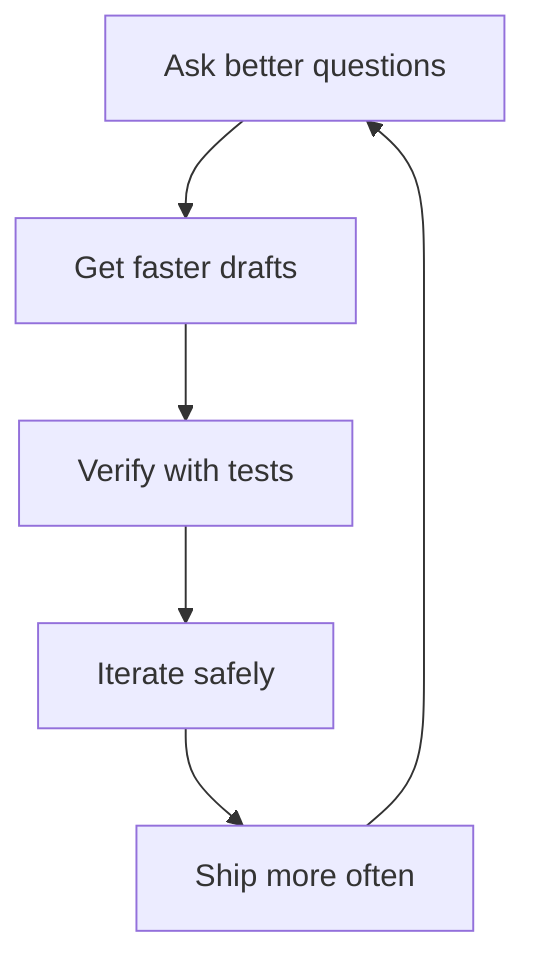

# AI induced productivity

| Zone       | Best AI role     | Example prompt                  |
| ---------- | ---------------- | ------------------------------- |
| Understand | Explainer        | “What does this module do?”     |
| Generate   | Draft writer     | “Create CRUD endpoint skeleton” |
| Accelerate | Autocomplete     | (auto-generated boilerplate)    |
| Transform  | Refactor partner | “Split into smaller functions”  |
| Verify     | Reviewer/tester  | “Find edge cases, add tests”    |
| Navigate   | Search assistant | “Where is auth enforced?”       |

## Time-savers in writing code

Here are the different ways of "generating" code

| Tool | Method | Potential time-saver |
|---|---|---|
| No AI | Lookup existing code (incl stackoverflow), copy-paste, adapt | Avoid re-learning stuff that someone learnt |
| Autocomplete | LLM does a best-guess based on your code context | Avoid manual copy-paste-adapt |
| Start a project | LLM gives the most common starting-point | Avoid going through the "Get started" documentation |
| Re-usable instructions | LLM tunes its output based on team standards | Avoid hiccups in onboarding and review burden |
| Skills | LLM picks the instructions based on context (progressive disclosure) | Avoid unexpected consequence of updating the instructions (modular instructions) |
| Agents | LLM can automatically trigger modules based on user-need | Avoid bespoke development for every customer quirk |

## Low trust = Low adoption

AI can be magic

- fast test generation
- refactor suggestion
- documentation draft

AI can be garbage

- confident wrong answer
- insecure code
- hallucinated API
- messed up dependencies

The discipline

- AI writes drafts, humans own decisions
- Never trust without tests
- Always constrain prompts
- Keep agents on rails

>Productivity comes from workflow discipline, not tool access.

