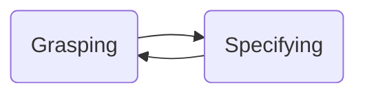

# Coding

Grasping and Specifying form a learning cycle

```mermaid
flowchart LR
  G(Grasping) --> S(Specifying)
  S --> G
```

By 'specifying', you remove ambiguity.
The activity of 'coding' achieves 'unambiguous communication'.
